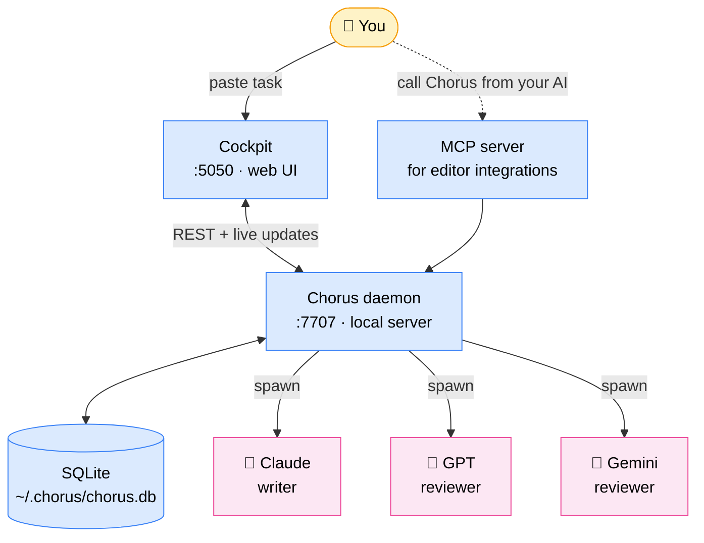

<div align="center">


# Chorus

**A second opinion (and a third) before you ship AI-written code — using the AI subscriptions you already pay for.**

2–3 *different* AI tools review the same change in parallel, only green-lighting when they agree. Runs on your existing Claude Pro / ChatGPT Plus / Gemini Advanced — typical review costs **$0** out of pocket.

[](https://github.com/chorus-codes/chorus/actions/workflows/ci.yml)
[](https://www.npmjs.com/package/chorus-codes)
[](./LICENSE)
[]()
[]()

[Website](https://chorus.codes) · [Roadmap](./ROADMAP.md) · [Issues](https://github.com/chorus-codes/chorus/issues)

</div>

---

<div align="center">


**One AI writes. Three review. You ship only when they agree — using AI subscriptions you already pay for.**

</div>

---

## The problem Chorus solves

🤖 **AI coding tools are confident — and wrong about 5% of the time** in subtle ways that are hard to spot until production.

🪞 **The model that wrote your code can't see its own blind spots.**
Asking GPT to review GPT's work is theatre — same training, same biases.

💸 **Multi-AI review on raw API keys gets expensive fast.**
Every diff × 3 reviewers × pay-per-token = real money. So nobody does it routinely.

### Chorus fixes all three

✅ **Different vendors review each other.**
Claude writes, GPT and Gemini check it. Different blind spots cover each other. Disagreement = red flag *before* you merge.

✅ **Uses your existing AI subscriptions.**
You're already paying for Claude Pro / ChatGPT Plus / Gemini Advanced (~$20/mo each). Chorus drives them headlessly through their CLIs — every multi-AI review costs **$0 out of pocket**, just counts against the quota you already have. Per-token API users save 10-100× vs running the same prompts directly.

✅ **Local-first, zero markup.**
Your code never reaches a new vendor. Chorus runs on your laptop, talks to the AI tools you already trust, and shuts up. Open source, Apache-2.0.

That's the whole pitch.

---

## Real moments where this matters

🚨 **You asked Claude to write a `divide(a, b)` helper.**
It says "looks correct!" You ship. Production crashes at 2am because nobody handled `b = 0`.
*With Chorus: GPT or Gemini would have flagged it in the review pass before you merged.*

🔧 **You're refactoring a critical path.**
Your AI rewrote 200 lines and says it's behaviour-equivalent. You're tired and skeptical.
*Run it through Chorus. Three different AIs all saying "yes, equivalent" lets you sleep.*

🏗️ **Big architectural call** — queue vs polling, sync vs async, this DB vs that one.
Write a paragraph, hit Chorus. *Three different models give you three angles you hadn't thought of.*

📝 **Reviewing a 600-line PR.**
You're short on time. Paste the diff into Chorus. *Three reviewers spot the obvious bugs in 90 seconds. Your job becomes the 5% they couldn't catch.*

⚔️ **Test-driven development where neither AI cheats.**
*One AI writes tests blind to the code; another AI writes code to pass them.* Use the `red-green` template.

🐛 **Hunting a flaky bug.**
Reproduces 1-in-20, no obvious pattern. Drop the failing test + suspect code into Chorus.
*Each reviewer attacks the bug from a different angle — race? clock skew? off-by-one? — and you land on the cause faster than walking it alone.*

---

## Quick start

```bash
npm i -g chorus-codes      # install (no sudo — see below)
chorus init                # finds AI tools you already have, wires up MCP
chorus start --ui          # opens http://localhost:5050
```

Paste a task. Hit submit. Watch the AIs argue.

> **Don't `sudo npm install -g`** if you use nvm, fnm, asdf, or any per-user
> Node manager. `sudo` writes to root's npm prefix (`/usr/local/...`) but
> your `chorus` command resolves through your user prefix — the install
> succeeds in a place PATH never sees, leaving you on a stale version.
> If `npm install -g` errors with EACCES, set up an unprivileged prefix:
> `npm config set prefix ~/.npm-global` then add `~/.npm-global/bin` to
> your PATH.

To upgrade later: `chorus update`. The updater locates the running binary
and writes to that exact install location, so it always lands where PATH
expects regardless of how you installed.

### Or drive it from any AI CLI you already use

`chorus init` registers Chorus as an MCP server with every CLI / IDE it detects (Claude Code, Codex, Gemini CLI, Cursor, Windsurf, Kimi, OpenCode). After that, just ask the assistant in plain English:

```
> Use chorus to review the staged diff against main
> Ask chorus to run the architect-review template on src/payments/*.ts
> chorus, get a second opinion on this function from claude + gemini
```

Or invoke a specific MCP tool directly — every CLI uses the same name (`chorus`) and exposes nine tools:

| Tool | What it does |
|---|---|
| `create_chat` | Kick off a review (returns a `chatId` + URL) |
| `wait_for_chat` | Block until the run reaches a terminal state |
| `get_chat_status` | Poll a running chat without blocking |
| `cancel_chat` / `resume_chat` | Stop or restart |
| `list_templates` / `list_personas` | Discover what's available |
| `invoke_persona` | Run a single persona (skip multi-reviewer fan-out) |
| `list_blocked` | See chats that need human input |

Example raw invocation (from any MCP client):

```jsonc
// tool: chorus.create_chat
{
  "template": "code-review",
  "work": "Review the staged diff vs main. Flag race conditions and missing tests."
}
// → { "chatId": "abc123", "url": "http://localhost:5050/runs/abc123", "status": "reviewing" }
```

Stream results back into your editor, or open the URL to watch live.

---

**Requires** Node 20+ and at least *one* of these (you probably already have one):

- Claude Code, Codex CLI, Gemini CLI, OpenCode, or Kimi CLI — uses your existing subscription, no extra cost
- *or* an OpenRouter API key (one key, 200+ models, pay-per-use)

<details>
<summary><b>Don't have any of those?</b></summary>

```bash
npm i -g @anthropic-ai/claude-code   # Anthropic — uses Claude Pro sub
npm i -g @openai/codex                # OpenAI — uses ChatGPT Plus sub
npm i -g @google/gemini-cli           # Google — uses Gemini Advanced sub
```

Pick whichever vendor you already pay for. Or skip CLIs entirely and add an OpenRouter key in Settings after `chorus init`.

</details>

---

## What it looks like

<table>
<tr>
<td width="50%" align="center">
<b>Live review</b><br/>
<br/>
<sub>Each AI streams its thinking live as it reviews.</sub>
</td>
<td width="50%" align="center">
<b>Verdict</b><br/>
<br/>
<sub>Agreement = green. Disagreement = retry with their feedback.</sub>
</td>
</tr>
<tr>
<td width="50%" align="center">
<b>Templates</b><br/>
<br/>
<sub>Pre-built review patterns. Make your own in YAML.</sub>
</td>
<td width="50%" align="center">
<b>From inside Claude / Cursor</b><br/>
<br/>
<sub>Any AI tool that speaks MCP can trigger a Chorus run.</sub>
</td>
</tr>
</table>

---

## A real example

You ask Claude to write this:

```js
function divide(a, b) {
  return a / b;
}
```

Submit to Chorus with the **Code Review** template (1 writer + 2 reviewers, both must agree to ship):

| Step | What happens |
|---|---|
| 1. Claude writes | "Looks correct to me!" |
| 2. GPT reviews in parallel | 🚨 *No type validation — `divide('a','b')` returns `NaN`* |
| 3. Gemini reviews in parallel | 🚨 *Missing zero-check — `divide(1, 0)` returns `Infinity`* |
| 4. Verdict | ❌ **REJECT** — both reviewers flagged real bugs |

Now you know what to fix **before** you push.

---

## Templates: pre-built review patterns

Don't figure out which AIs to use yourself. Pick a pattern that fits the moment:

| Use this when... | Template |
|---|---|
| Pre-merge sanity check | `code-review` — 1 writer + 2 reviewers, both must agree |
| Diagnosing a weird bug | `bug-diagnose` — one hypothesises, one challenges |
| Big architectural call | `architect-review` — 3 different vendors critique your plan |
| TDD where neither AI cheats | `red-green` — tests written blind to code |
| Quick audit of a diff someone else wrote | `review-only` — paste, get 3 opinions, no writer |

Make your own by dropping a YAML file in `~/.chorus/templates/`. Or duplicate one of the built-ins and tweak.

<details>
<summary><b>Custom template example</b></summary>

```yaml
id: security-pre-merge
label: Security Pre-Merge
description: Sentinel persona on every reviewer; everyone must approve.
slots:
  doer:
    lineage: anthropic
    model: claude-sonnet-4-6
  reviewers:
    - { lineage: openai,   model: codex,                 persona: sentinel }
    - { lineage: google,   model: gemini-2.5-pro,        persona: sentinel }
    - { lineage: opencode, model: opencode-go/kimi-k2.6, persona: sentinel }
quorum:
  type: unanimous
```

</details>

---

## Reviewer personas

Each reviewer can wear a "hat" — a focus area Chorus prepends to their prompt:

| Persona | What they look for |
|---|---|
| 🛡️ **Sentinel** | Security holes, auth bypass, injection |
| 🗺️ **Cartographer** | Cross-platform issues (Windows vs Mac, browser support) |
| 💰 **Accountant** | Cost regressions (extra DB queries, API calls) |
| ⚡ **Profiler** | Performance regressions |
| 🔍 **Inspector**, 📦 **Quartermaster**, 🛎️ **Concierge**, 🏛️ **Conservator**, 📚 **Librarian**, 🌐 **Translator** | …and more — see Personas page in cockpit |

Different personas reviewing the same change = wider net.

---

## Why "different vendors" matters

You can run Chorus with three Claudes. We let you. But the value drops a lot.

A second Claude reviewing the first Claude's work is theatre — same training, same blind spots. Mix vendors (Claude + GPT + Gemini) and you get genuinely different angles, because they were trained on different data with different biases.

Templates let you encode this: each reviewer slot has a `lineage` (anthropic / openai / google / opencode / moonshot). Built-in templates mix vendors automatically.

---

## What does it cost?

Two paths, depending on how you already pay for AI:

**Using subscriptions** (Claude Pro / ChatGPT Plus / Gemini Advanced — ~$20/mo each)
A typical review = **$0** out of pocket. Counts against the quota you already have.

**Using API keys** (pay-per-use)
A typical code-review run = **$0.30 to $1.50**, depending on diff size. If reviewers disagree and retry, 2–3× worst case.

Chorus adds **zero markup**. We don't see your tokens.

---

## Permissions & safety

Reviewers run on your machine. You decide how much trust to give them:

| Mode | Read code | Write code | Network | When to use |
|---|:---:|:---:|:---:|---|
| 🔒 **Strict** | ✅ | ❌ | ❌ | Reviewing a diff you don't trust |
| 📁 **Workspace** *(default)* | ✅ | ✅ inside chat dir | ❌ | Day-to-day |
| 🔓 **Full** | ✅ | ✅ anywhere | ✅ | Personal machine, full trust |

Configure on first run, or anytime at *Settings → Permissions*.

> **Trust model in plain English.** "Workspace" means the reviewer can write files inside its working directory and run scoped commands, but can't reach the internet or write outside the sandbox. "Full" means anything-goes — only enable on a personal machine you own. Run `chorus doctor` to verify each AI tool got the sandbox you set.

---

## Compared to other code-review tools

| | **Chorus** | CodeRabbit | Greptile | Cursor Review | GitHub Copilot |
|---|:---:|:---:|:---:|:---:|:---:|
| Multiple AI vendors review the same change | ✅ | ❌ | ❌ | ❌ | ❌ |
| Uses your existing AI subscriptions | ✅ | ❌ | ❌ | ❌ | ❌ |
| Runs locally (your code never leaves your existing AI vendors) | ✅ | ❌ | ❌ | partial | ❌ |
| Open source (modify + self-host) | ✅ Apache-2.0 | ❌ | ❌ | ❌ | ❌ |
| Custom review patterns | ✅ | partial | ❌ | ❌ | ❌ |

**The unique thing:** your code never goes to a new vendor. Chorus just orchestrates the AI tools you already use.

---

## Commands

```bash
chorus init             # one-time: detect + connect AI tools
chorus start --ui       # boot + open browser
chorus stop             # shut it down
chorus status           # is it running?
chorus doctor           # diagnose AI tool detection / sandbox issues
chorus diagnose         # print a redacted diagnostic bundle for bug reports
```

---

## Reporting bugs

When something goes wrong, run:

```bash
chorus diagnose
```

It prints a fenced markdown block with: chorus version, running daemon
version (and a **VERSION MISMATCH** flag if the CLI was upgraded but the
daemon hasn't been restarted), node + OS + arch, daemon health, DB
counts, CLI detection, the latest crash dump if any, and the last 50
lines of `daemon.log`. Paste the block into a new issue at
<https://github.com/chorus-codes/chorus/issues/new>.

If chorus crashes hard (uncaught exception during boot — common on
older Node + Windows combos), a self-contained crash log is written to
`~/.chorus/crashes/<timestamp>.log`. Attach it to the issue.

---

## Telemetry

Chorus pings home once on startup and once every 24h. The payload is fixed:

```json
{
  "schema": 1,
  "installId": "<random uuid>",
  "version": "0.7.0",
  "os": "linux", "arch": "x64", "node": "22",
  "daemonUptimeSeconds": 86400,
  "chatsLast24h": 12
}
```

**Never sent:** chat content, prompts, file paths, repo paths, model names, voice/template names, hostnames, IPs, API keys.

Turn it off any of three ways:

```bash
export CHORUS_TELEMETRY=0           # env var
touch ~/.chorus/no-telemetry        # touch-file
# or click "Off" in cockpit Settings → Telemetry
```

The install ID lives at `~/.chorus/install-id` — `rm` it for a fresh one.

---

## Roadmap

- [x] **v0.5** — Daemon + cockpit + 4 AI vendors
- [x] **v0.6** — MCP server, persona system
- [x] **v0.7** — OpenRouter integration, voices table, real-time sidebar
- [ ] **v0.8** — Multi-stage review (write → review → fix → re-review)
- [ ] **v0.9** — Per-voice persona overrides
- [ ] **v1.0** — Hosted GitHub App + cloud fan-out

Full picture in [ROADMAP.md](./ROADMAP.md).

---

<details>
<summary><b>How it works (under the hood)</b></summary>



**Three pieces:**

- **Daemon** — small local server (port 7707) that spawns AI tools as subprocesses, parses their output, and tracks state in a SQLite database at `~/.chorus/chorus.db`.
- **Cockpit** — the web UI at port 5050 (Next.js). Templates, chats, voices, settings.
- **MCP server** — lets *other* AI tools (Claude Code, Cursor, etc.) call Chorus programmatically.

Each AI runs as an isolated subprocess. Chorus reads their structured output (stream-JSON), compares against the template's quorum rule, and emits a verdict. Nothing leaves your machine except the calls to the AI vendors you already use.

Code layout:
- `src/daemon/` — Fastify server + agent shims (one per AI tool)
- `src/app/` — Next.js cockpit
- `src/mcp/` — JSON-RPC MCP server
- `src/lib/db/` — schema + migrations

</details>

---

## Contributing

PRs welcome.

```bash
git clone https://github.com/chorus-codes/chorus.git
cd chorus && pnpm install
pnpm dev:daemon   # daemon on :7707
pnpm dev          # cockpit on :5050
pnpm test         # full suite
```

Read [`AGENTS.md`](./AGENTS.md) first — Next.js 16 has breaking changes from older versions. Coverage target on new code: 80%+.

We dogfood: PRs to Chorus go through Chorus before merging.

See [CONTRIBUTING.md](./CONTRIBUTING.md) for the full guide.

---

## Links

- 🌐 Website: <https://chorus.codes>
- 🗺️ Roadmap: [./ROADMAP.md](./ROADMAP.md)
- 🐛 Issues: <https://github.com/chorus-codes/chorus/issues>
- 💬 Discussions: <https://github.com/chorus-codes/chorus/discussions>
- 🐦 Twitter / X: [@chorus_codes](https://twitter.com/chorus_codes)

---

## License

[Apache-2.0](./LICENSE). Use it however you want, including commercially.
